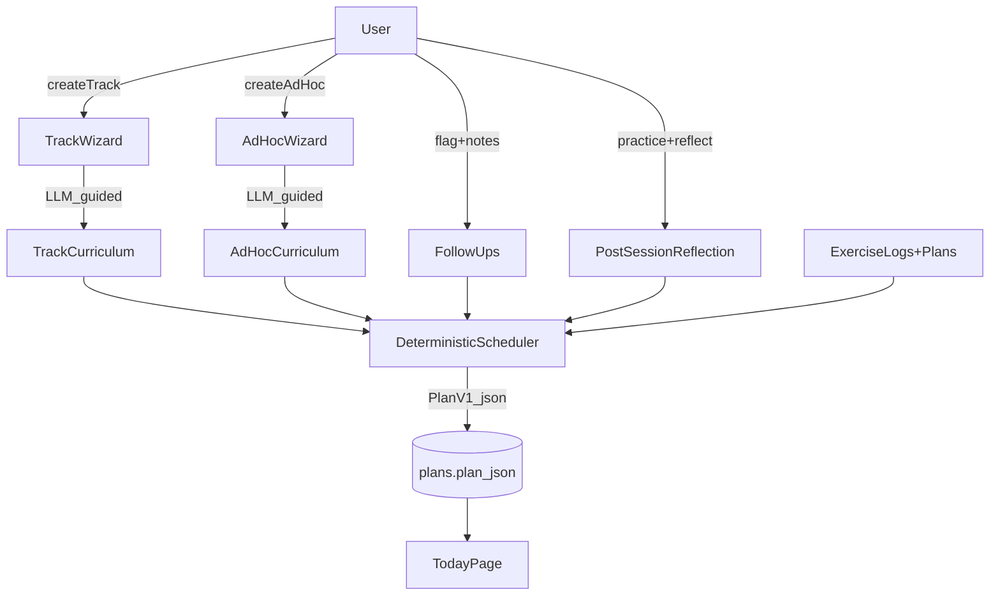

# Adaptive, AI-Enabled Learning Paths (v1)

## Goals

- Make daily plans **change over time** (not repeat), while staying **predictable** and **adjustable**.
- Use **hybrid progression**: time-based phases by default, but user feedback can slow/accelerate.
- Capture feedback via **Follow-ups + End-of-session Reflection** and feed it back into scheduling.
- Add **AI-assisted wizards** for creating:
- new tracks (e.g. Punk Rock)
- ad-hoc one-off plans (guided prompt)

## Key design

- **Deterministic scheduler** decides *what to practice* from data (curriculum phases + exercise pool + recent history).
- **LLM is optional and bounded**: used to help generate/adjust curricula and to write human-friendly instructions, but the scheduler enforces constraints (4 blocks, ≥30 min, difficulty caps).

## Data model changes (Supabase)

Add new tables (all with `user_id`, timestamps, and RLS policies like existing tables):

- **`plan_track_curricula`**: per-track curriculum definition (phases/weeks, objectives, constraints).
- **`plan_track_exercises`**: normalized “exercise pool” for a track (tags, difficulty, block suitability, prerequisites).
- **`track_progress_state`**: per-track state (current phase/week, last advanced date, pace multiplier, manual overrides).
- **`practice_reflections`**: per practice session/day reflection (hard/easy notes, confidence sliders, time, pain points).
- (Optional) **`ad_hoc_requests`**: store the prompt/intent for an ad-hoc plan and its resulting generated plan link.

Files:

- Add new migrations under `supabase/migrations/0008_...sql` (tables + indexes + RLS).

## Track + ad-hoc wizards (LLM-bounded)

- **TrackWizard** (new UI on `/plans`): asks a few questions and produces:
- track goals
- phase plan (weeks)
- initial exercise pool
- daily structure defaults
- **AdHocWizard** (new UI on `/today` or `/plans`): asks for:
- goal
- time budget
- constraints (what you already know, what’s hard)
- outputs a small “mini-curriculum” (1–3 days) or a single-day plan intent.

Implementation:

- Add API route(s) that call the LLM and return **strict JSON** (validated with Zod) to write into curriculum/exercise tables.

## Deterministic scheduler (core)

Replace the current static `generatePlanV1()` usage with a scheduler that:

- Selects exercises by:
- current phase/week
- spaced repetition (recent logs)
- open follow-ups (priority insertion)
- reflection signals (e.g. “hard” => repeat, “easy” => progress)
- Ensures constraints:
- all 4 blocks present
- ≥30 minutes total
- “New” is capped (e.g. 1 concept)
- Produces PlanV1 JSON and persists to `public.plans` (existing behavior)

Files:

- Refactor [`apps/web/src/lib/plan/generate.ts`](/Users/scott/repos/guitar/apps/web/src/lib/plan/generate.ts) into:
- `scheduler.ts` (deterministic selection)
- `templates.ts` (exercise definitions / rendering text)
- keep `schema.ts` for strict validation
- Update [`apps/web/src/lib/plan/service.ts`](/Users/scott/repos/guitar/apps/web/src/lib/plan/service.ts) to use scheduler.

## Feedback loop

- **Follow-ups** already exist; extend UI to allow adding a short note/“why” and optionally a tag.
- Add a **Reflection form** at end of session (or on Today page):
- “What felt hard/easy?”
- confidence sliders per block
- freeform note
- Scheduler reads these to adjust progression pace and what gets repeated.

Files:

- Add reflection form to Today UI under `[apps/web/src/app/(app)/today/*](/Users/scott/repos/guitar/apps/web/src/app/\\(app)/today/page.tsx)`
- Add server actions to persist reflections.

## Rollout steps

1) Add schema + RLS migrations for curriculum/progress/reflections.2) Implement TrackWizard + AdHocWizard that write curriculum/exercises.3) Implement deterministic scheduler and swap it into `/api/plan/generate`.4) Add reflection capture and wire scheduler to use reflection + follow-ups.5) Iterate on defaults for “Beginner Jazz Guitar” curriculum.

## Acceptance criteria

- Daily plans for a track **change across days** (vary review/new/apply) while remaining consistent with the track’s curriculum.
- User feedback (follow-ups + reflection) measurably affects the next generated plan.